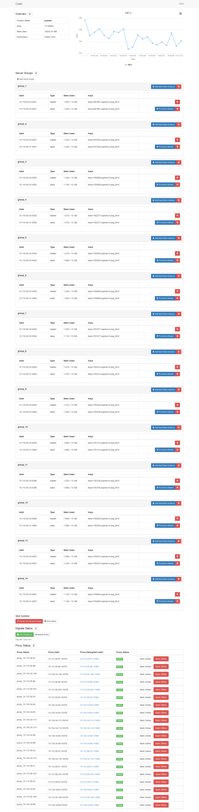
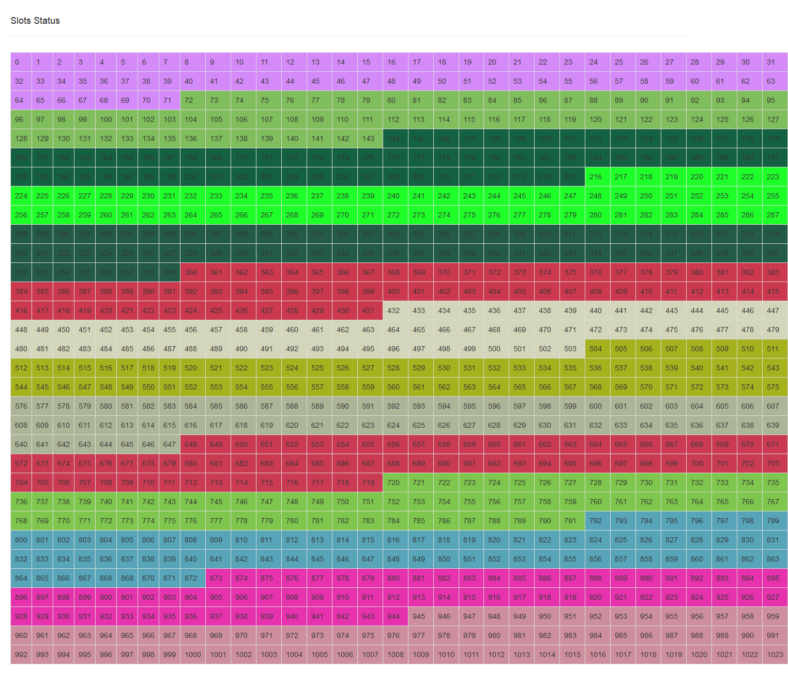
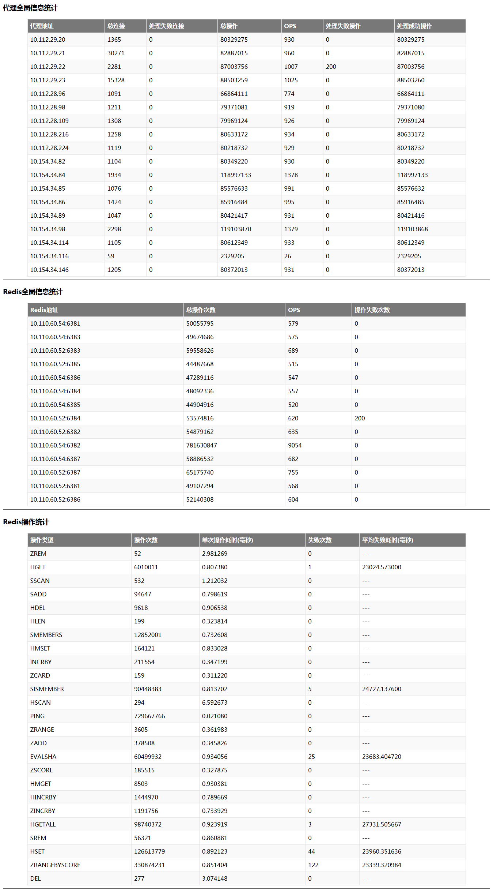
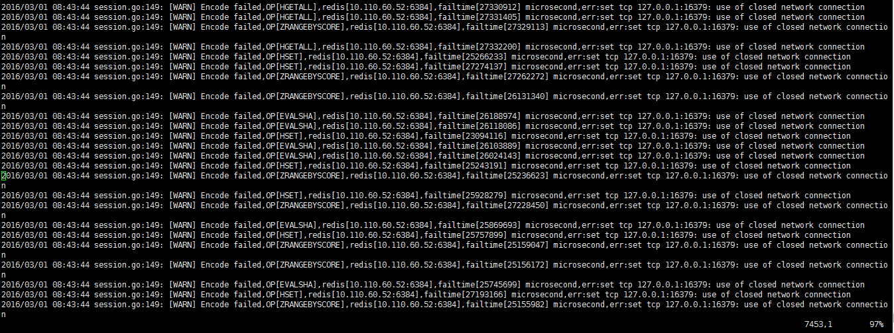
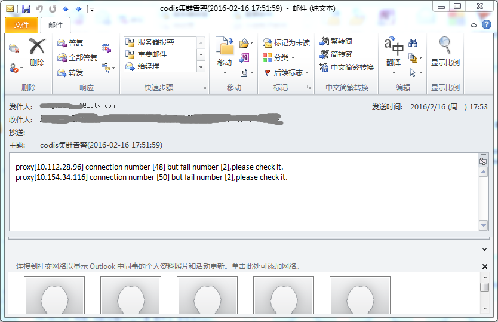
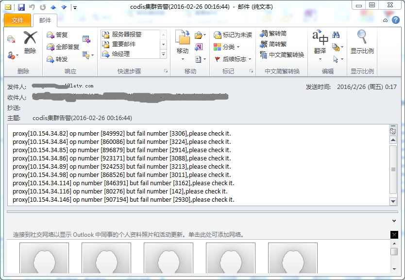
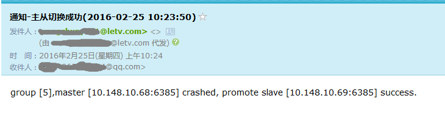

#Codis - Redis cluster solution supporting pipeline and scaling dynamically

Codis is a proxy based high performance Redis cluster solution written in Go. It is production-ready and widely used at [wandoujia.com](http://wandoujia.com) and many companies. You can see [Codis Releases](https://github.com/wandoulabs/codis/releases) for latest and most stable realeases.

##changed base on codis 2.x
  
### 版本说明
该版本codis是在豌豆荚开源软件codis( https://github.com/CodisLabs/codis )的基础上修改而成，主要做了以下修改  

1. 优化错误日志输出   
2. codis-proxy与zookeeper连接断开后进行重新连接而不是退出  
3. 当slot状态为migrate时可以设置其状态(避免单个slot一直迁移失败的情况下无法恢复)  
4. 获取OPS时传输的额外信息数据过大，裁剪掉  
5. 在codis-proxy上添加监控代码，以便监控及生成日志(每个redis命令的操作次数/
    每个代理的操作次数/每个redis机器的操作次数等)    
6. redis-server修改，大内存机器上多实例提高单机内存利用率(以前是1/2，修改后理论上利
    用率可以达到 n-1/n)

### 线上环境配套工具
1. 报表生成及实时业务监控
    https://github.com/wlibo666/myowncode/tree/master/ProcessMoniData
2. 检测redis联通性及响应时间，根据返回值处理，若响应时间过长需要报警(需配合脚本)
    https://github.com/wlibo666/myowncode/tree/master/CheckRedis
3. zookeeper上slot信息复制(机房整体迁移时需要将老的slot分布同步到新机房内，同时要同步所有数据，
    必须要保证slot分布的正确性)
    https://github.com/wlibo666/myowncode/tree/master/CopySlotInfo
4. 删除迁移任务工具(当迁移出错时可以取消迁移任务)
    https://github.com/wlibo666/myowncode/tree/master/delMigrateTasks
5. slot迁移检测工具(单个key内存过大时，正常迁移会导致服务停止，需要检测该slot是否可迁移)
    https://github.com/wlibo666/myowncode/blob/master/checkSlot.go
6. 大key迁移工具(曾经遇到单个key内存近3G，正常迁移时会导致服务停止，需单独处理)
    https://github.com/wlibo666/myowncode/tree/master/MigrateBigKey
7. codis-ha 官方逻辑(https://github.com/ngaut/codis-ha)是取第一个slave，一旦第一个salve挂掉，即使其他slave存活该组服务也会停止；
    现改为从多个salve中取第一个存活的slave；添加邮件告警(server挂掉/自动切换/重用offline机器)
    https://github.com/wlibo666/codis-ha
8. redis实例内存检测脚本(通过dashboard获取所有redis实例，单redis master实例内存使用超过限定值的80%后邮件告警，
    表明需要扩容)
    https://github.com/wlibo666/myowncode/tree/master/scripts/CheckRedisMemory
9. 数据备份脚本(通过dashboard获取所有redis实例，从slave实例机器上将数据统一备份到指定服务器)
    https://github.com/wlibo666/myowncode/tree/master/scripts/RedisDataBackup
10.主从同步检测(从dashboard获取所有redis实例，定时检测每组的master和slave同步情况，若停止同步，则重新全同步)
    https://github.com/wlibo666/myowncode/tree/master/scripts/SlaveSyncCheck
11. 批量安装部署脚本    
    https://github.com/wlibo666/codis/tree/master/autoinstall   

##codis 部署安装   
http://www.cnblogs.com/wlibo666/p/5235620.html  

## 线上环境工具使用(自动部署监控等)   
http://www.cnblogs.com/wlibo666/p/5235641.html   

## Snapshots
Dashboard

Slots

Report
  
从报表中可以看到代理机器 10.112.29.22 处理redis请求失败200次，可以据此去该机器内查看详细信息

Error
  
从错误日志可以看出失败的每个操作以及失败的原因，该图原因是因为网络抖动，导致proxy与redis的连接断开一秒

Proxy Connections Warning   
   

Proxy Operation Warning   
   

Codis-HA Warning   
   

##Authors

Active authors:
* [@spinlock9](https://github.com/spinlock) [微博@斯宾洛克](http://weibo.com/spinlock9)
* [@yangzhe1991](https://github.com/yangzhe1991) [微博@\_杨肉\_](http://weibo.com/yangzhe1991)

Emeritus authors:
* [@goroutine](https://github.com/ngaut) [微博@goroutine](http://weibo.com/u/1923497393)
* [@c4pt0r](https://github.com/c4pt0r) [微博@Dongxu_Huang](http://weibo.com/c4pt0r)

Thanks:
* [@ivanzhaowy](https://github.com/ivanzhaowy)
* [@Apache9](https://github.com/apache9) [微博@Apache9](http://weibo.com/u/1876829375)

## License

Codis is licensed under MIT， see MIT-LICENSE.txt

-------------
*You are welcome to use Codis in your product, and feel free to let us know~ :)*
